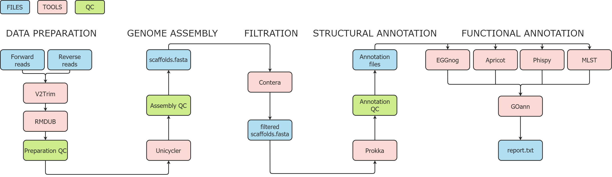

# Pannopi - from reads to functional annotation pipeline
 
## Workflow

## Dependencies
1) [Eggnog-mapper](https://github.com/eggnogdb/eggnog-mapper) - to download [EggNOG v5](http://eggnog5.embl.de/#/app/home) database for functional annotation
2) [BLAST+](https://blast.ncbi.nlm.nih.gov/Blast.cgi?PAGE_TYPE=BlastDocs&DOC_TYPE=Download) - to download and create BLAST NT database for genome content identification and filtering
3) [Mamba](https://github.com/mamba-org/mamba) - to install all the tool included in Pannopi
4) [Snakemake](https://snakemake.readthedocs.io/en/stable/index.html) - to run Pannopi
## Install, set and run
Pannopi is available in conda, to install and set is use following commands:
1) Download Pannopi in separate conda envieronment: `conda create -n pannopi -c conda-forge -c bioconda -c aglab pannopi`
2) Activate the envieronment: `conda activate pannopi`
3) Eggnog-mapper databae (~50GB) is required to run Pannopi. BLAST NT (~110 GB) is needed for genome 
   filtration, but not necessary. You can download each of it together or separately or set your own ones, 
   if you have it already. Use `pannopi_download_db` tool to set or download databases. Examples:
   ```
   # Download all databases
   pannopi_download_db -m all -o /path/to/database/directory
  
   # Download eggnog-mapper/blast database 
   pannopi_download_db -m eggnog/blast -o /path/to/database/directory
   
   # Set yours eggnog or blast database
   pannopi_download_db -m set -e /path/to/eggnog/database -b /path/to/blast/database/nt
   ```
4) To run Pannopi on your reads use one of the following commands:
   ```
   # If you have only short reads
   pannopi -m short -1 /path/to/forward_read_1.fastq -2 /path/to/reverse_read_2.fastq -r /path/to/reference.fasta -t 32 -o /path/to/outdir

   # If you have only long reads
   pannopi -m long -l /path/to/long_read.fastq -t 32 -o /path/to/outdir

   # If you have both short and long reads
   pannopi -m hybrid -1 /path/to/forward_read_1.fastq -2 /path/to/reverse_read_2.fastq -l /path/to/long_read.fastq -t 32 -o /path/to/outdir

   # If you have only assembly and wanna evaluate QC and annotate your genome 
   pannopi -m anno -a /path/to/assembly.fasta -r /path/to/reference -t 32 -o /path/to/outdir
   ```

## Modes

All modes except **anno** are used [Unicycler](https://github.com/rrwick/Unicycler) tool for genome assembly, modes are:
1) **Short** - mode for analysis of short reads. Starts with preparation of reads with [v2trim](https://github.com/aglabx/v2trim) and [rmdub](https://github.com/aglabx/rmdub). 
   Data preparation QC with [FastQC](https://github.com/s-andrews/FastQC), [Jellyfish](https://github.com/gmarcais/Jellyfish) and [GenomeScope v2](https://github.com/tbenavi1/genomescope2.0).
2) **Long** - mode for analysis of short reads. 
3) **Hybrid** - mode for analysis of both short- and long-reads with hybrid assembly. Reads QC as in **Short** mode.
4) **Anno** - mode to evaluate quality of your assembly and to annotate it.

## Filtration and Assembly QC
1) Filtration of technical sequences contamination with [Contera](https://github.com/zilov/contera). If BLAST NT database is provided Contera will report 
   about genome taxonomic content.
2) Statistical QC of assembly with [QUAST](https://github.com/ablab/quast).
3) ANI analysis with FastANI. Works only if reference (or close) genome are provided with `-r` argument.

## Annotation
1) Structural annotation with [Prokka](https://github.com/tseemann/prokka)
2) Functional annotation with [eggnog-mapper](https://github.com/eggnogdb/eggnog-mapper)
3) Antibiotic resistance, virulence, plasmid and serotype (only for E. Coli) genes with [Abricate](https://github.com/tseemann/abricate)
4) MLST genes with [MLST](https://github.com/tseemann/mlst)
5) CRISPRs with [CRISPRCasFinder](https://github.com/dcouvin/CRISPRCasFinder) (in progress...)
6) Genome visualisation with [pyCircos](https://github.com/ponnhide/pyCircos) (in progress...)

## Command line options 

```
-m (–mode). Mode to run the pipeline [short, long or hybrid]. Single
for paired-end Illumina reads, long for long-reads, hybrid for hybrid
assembly with both short and long reads. [Required]
-1 (–forward). Path to forward read FASTQ file. [Required for short and hybrid modes]
-2 (–reverse). Path to reverse read FASTQ file. [Required for short and hybrid modes]
-l (–long-read). Path to reverse read FASTQ file. [Required for long and hybrid modes]
-r (–reference). Path to reference genome in FASTA format.
-t (–threads). Number of threads to use [Default is 4].
-o (–outdir). Path to output directory to store results. [Required]
parameter.
-d (–debug). Debug mode to check pipeline workflow.
-h (–help). Help message with arguments description.
```
## References
1) Köster, J., & Rahmann, S. (2012). Snakemake—a scalable bioinformatics workflow engine. Bioinformatics, 28(19), 2520-2522. [https://doi.org/10.1093/bioinformatics/bts480]
2) Wick, R. R., Judd, L. M., Gorrie, C. L., & Holt, K. E. (2017). Unicycler: resolving bacterial genome assemblies from short and long sequencing reads. PLoS computational biology, 13(6), e1005595. [https://doi.org/10.1371/journal.pcbi.1005595]
3) Gurevich, A., Saveliev, V., Vyahhi, N., & Tesler, G. (2013). QUAST: quality assessment tool for genome assemblies. Bioinformatics, 29(8), 1072-1075. [https://doi.org/10.1093/bioinformatics/btt086]
4) Seemann, T. (2014). Prokka: rapid prokaryotic genome annotation. Bioinformatics, 30(14), 2068-2069. [https://doi.org/10.1093/bioinformatics/btu153]
5) Huerta-Cepas, J., Forslund, K., Coelho, L. P., Szklarczyk, D., Jensen, L. J., Von Mering, C., & Bork, P. (2017). Fast genome-wide functional annotation through orthology assignment by eggNOG-mapper. Molecular biology and evolution, 34(8), 2115-2122. [https://doi.org/10.1093/molbev/msx148]
6) Huerta-Cepas, J., Szklarczyk, D., Heller, D., Hernández-Plaza, A., Forslund, S. K., Cook, H., ... & Bork, P. (2019). eggNOG 5.0: a hierarchical, functionally and phylogenetically annotated orthology resource based on 5090 organisms and 2502 viruses. Nucleic acids research, 47(D1), D309-D314. [https://doi.org/10.1093/nar/gky1085]
7) Seppey, M., Manni, M., & Zdobnov, E. M. (2019). BUSCO: assessing genome assembly and annotation completeness. In Gene prediction (pp. 227-245). Humana, New York, NY. [https://doi.org/10.1007/978-1-4939-9173-0_14]
8) Jain, C., Rodriguez-R, L. M., Phillippy, A. M., Konstantinidis, K. T., & Aluru, S. (2018). High throughput ANI analysis of 90K prokaryotic genomes reveals clear species boundaries. Nature communications, 9(1), 1-8. [https://doi.org/10.1038/s41467-018-07641-9]
9) Ranallo-Benavidez, T. R., Jaron, K. S., & Schatz, M. C. (2020). GenomeScope 2.0 and Smudgeplot for reference-free profiling of polyploid genomes. Nature Communications, 11(1), 1-10. [https://doi.org/10.1038/s41467-020-14998-3]
